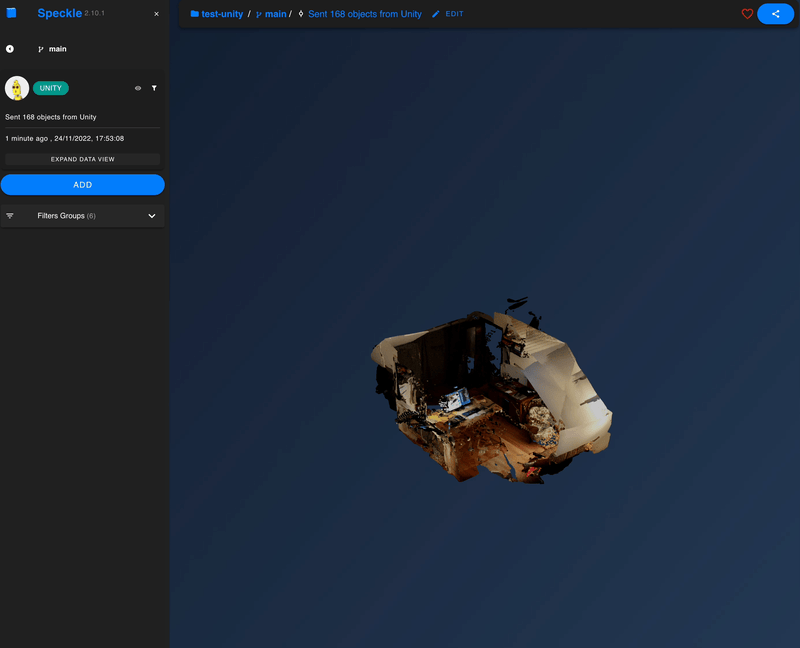

# ar2speckle

### Sync :iphone: ARKit with any :building_construction:  CAD / BIM Application using 💙 [Speckle](https://speckle.systems/)
 

The goal is to have an `ARKit` app that captures a room ( `LiDAR point cloud`, `detected planes`, etc.) & sends it to your `CAD`. There you can start modeling based on the scan & push it back to the `ARKit` app to visualize your model in the physical context.

🚧 Early work in progress 🚧

#### Scanned room in [Speckle](https://speckle.systems/) Web App

#### iOS app

## Road Map

- [x] Send colored `LiDAR point cloud` :cloud: from `ARKit` &rarr; `Speckle`
- [ ] Send `detected planes` from `ARKit` &rarr; `Speckle`
- [ ] Send `cad model` from `Speckle` &rarr; `ARKit`

## How To Use

- Get a [Speckle](https://speckle.systems/) Account
- Generate a [Personal Access Token](https://speckle.guide/dev/tokens.html/) for authentification.
- Add the `token` to the `SpeckleTokenConnector` or at runtime via the `UI`
- Build on an `iOS device` with `LiDAR` support
- Tap the screen to add more `points` to the `point cloud`
- Select `stream` from the `dropdown`
- Send to `Speckle`

⚠️ To make the Unity Connector run on an iOS device, the project uses this [fork](https://github.com/dominikganghofer/speckle-unity)  with a few minor changes.

Tested on `Unity 2022.2`, `iPad Pro 11` with `iPadOS 16`, `XCode 14.1` & `Ventura 13`

## Related
- [Speckle](https://speckle.systems/) 🚀
- [Official Speckle &larr;&rarr; Unity Connector](https://github.com/specklesystems/speckle-unity)
- [Fork](https://github.com/dominikganghofer/speckle-unity) used as `Unity package` in this project

## License
Apache License 2.0

